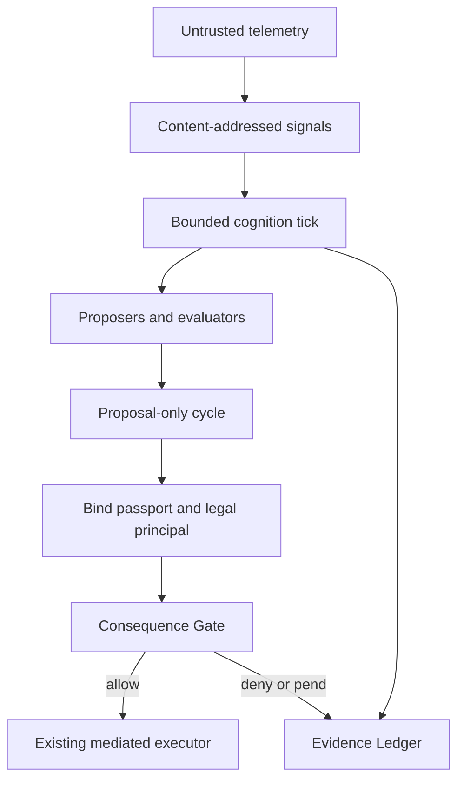

# ADE-1 governed runtime architecture

## Decision

ADE-1 is implemented as **standing cognition under human and constitutional
sovereignty**. The original blueprint's telemetry, memory continuity,
deliberation, resource conservation, and durable scheduling are retained. Its
claims of sovereign intent, autonomous treasury ownership, immutable
self-preservation, attention harvesting, direct execution, and self-modification
are rejected because they would bypass the kernel invariant.

## Runtime boundary

The standing runtime has no executor reference. The adapter is a separate
module so reviewers can identify the only legal route out of cognition.

## Blueprint translation

| Blueprint concept | Governed implementation | Non-negotiable limit |
|---|---|---|
| Telemetry firehose | `SignalEnvelope` ingestion | Incoming instructions remain untrusted data |
| Memetic entropy | `semantic_centroid_drift` | Cosine drift is not called entropy |
| Autonomous tick | Idempotent `tick(trigger_id=...)` | Scheduler grants time, not authority |
| Multi-agent mind | Named proposers and evaluators | Required evaluators, vetoes, dissent retained |
| Long-term memory | Existing hash-chained Evidence Ledger | Corrections and conflicts append; nothing is erased |
| Vitality | Explicit call/cost `ResourceGovernor` | Attention cannot replenish money or permission |
| Hibernation | Hard-ceiling `HIBERNATING` state | Stopping remains unconditional |
| Sovereign wallet | Not implemented | Credentials and execution stay outside cognition |
| On-chain/social action | Candidate proposal | Must be bound and submitted through Consequence Gate |
| Self-modification | `ChangeProposal` | No self-apply method; external review is mandatory |
| Failover | Ledger reconstruction on process restart | Hosting redundancy does not change authority |
| Active inference | Deferred | Requires an explicit probabilistic generative model |

## Tick protocol

1. Validate a stable trigger ID, content-addressed signal IDs, declared context,
   call costs, and hard resource ceilings.
2. Return the recorded result on an exact retry. Retain and refuse any
   conflicting reuse of the trigger ID.
3. Refuse all cognition while suspended; enter hibernation before any model call
   when a hard ceiling is already exhausted.
4. Invoke proposer organs in sorted order. A crash is negative evidence and does
   not erase other candidates.
5. Invoke evaluator organs for every candidate. Guardian and Treasury are
   required by default; missing assessments and vetoes fail closed.
6. Select deterministically from non-vetoed candidates with complete required
   assessments. Preserve every candidate, assessment, objection, failure, and
   resource snapshot.
7. Append the cycle to the Evidence Ledger with disposition `proposal_only`.

## State and recovery

The source of continuity is the existing Evidence Ledger. On construction, the
runtime verifies persisted signal and candidate content identifiers while
rebuilding signals, completed trigger IDs, and suspension state. Redis or a
vector store may be added later as disposable indexes; neither should become
the authority source.

External vector and graph memories should store ledger record hashes in their
metadata. Retrieval output must return to the runtime as an untrusted signal and
must never carry a capability grant.

## Security properties

- Prompt-injection containment: telemetry is never interpreted by the runtime as
  control-plane instruction.
- Least authority: the runtime exposes no publish, transfer, trade, sign,
  execute, or apply-change method.
- Real accountability: gate binding requires both a machine actor and a legal
  principal; `UNIIMENTE` is rejected as a principal.
- Budget monotonicity: calls and estimated spend only increase; attention is
  telemetry and cannot modify ceilings.
- Negative-evidence retention: conflicting event IDs, conflicting trigger IDs,
  organ crashes, objections, and vetoes remain in the chain.
- Operator sovereignty: suspend is unconditional; resume requires an external
  SHA-256 authorization reference.

## Deployment order

1. Run the unit suite and institutional verifier.
2. Deploy in replay mode against recorded telemetry.
3. Run in shadow mode with no gate submission.
4. Enable gate submission for `read_only` and `internal_write` consequence
   classes under explicit capability grants.
5. Expand consequence classes only through existing ratified policy and human
   approval mechanisms.

No stage enables autonomous treasury control or self-modification.
